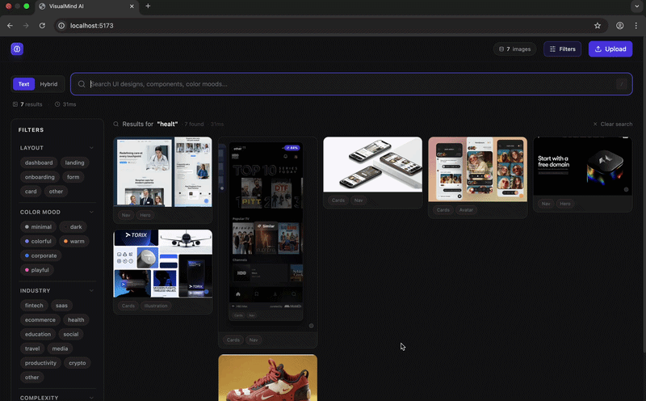

# VisualMind AI

** AI-powered visual memory system for designers and creative teams. The idea is to turn messy screenshot/reference collections into a searchable knowledge base. Users could save screenshots, UI inspirations, branding examples, landing pages, etc., and then search them naturally with queries like “find fintech-style onboarding screens” or “similar minimal landing pages.”
The goal is to help designers and agencies organize visual inspiration, rediscover past references quickly, and build a long-term “design intelligence” layer from accumulated work and screenshots instead of losing everything in random folders and tabs.**

Search a private image library with natural language — *"dark SaaS dashboard with sidebar nav"*, *"health app onboarding screen"*, *"warm e-commerce product cards"* — and get ranked results in under 500 ms.


---

## How It Works

1. **Upload** UI screenshots (PNG / JPEG / WebP)
2. **Auto-tag** — Google Gemini 2.5 Flash analyzes each image and extracts structured metadata: layout type, color mood, industry, UI patterns, complexity
3. **Encode** — CLIP ViT-B/32 generates a 512-dim visual embedding and stores it in Qdrant
4. **Search** — natural language queries are encoded with the same CLIP model; cosine similarity + tag keyword boost returns ranked results in real time

---

## Tech Stack

| Layer | Technology |
|---|---|
| Visual embeddings | [CLIP ViT-B/32](https://github.com/mlfoundations/open_clip) (OpenAI weights) |
| Vector database | [Qdrant](https://qdrant.tech) (cosine similarity, HNSW index) |
| VLM auto-tagging | Google Gemini 2.5 Flash |
| Backend API | FastAPI + Python 3.13 |
| Frontend | React 18 + Vite + TailwindCSS |
| Deduplication | pHash (Hamming distance < 10) |

---

## Features

- **Semantic text search** — CLIP-powered natural language to image retrieval
- **Hybrid search** — dense CLIP embeddings fused with BM25 keyword matching via Reciprocal Rank Fusion (RRF)
- **Similar image search** — find visually similar designs from any result
- **VLM auto-tagging** — Gemini extracts `layout_type`, `color_mood`, `ui_patterns`, `industry`, `complexity` for every upload
- **Tag-boosted reranking** — structured tags elevate semantically matched results above visually similar but irrelevant ones
- **Sidebar filters** — filter by layout, color mood, industry, complexity with instant re-query
- **pHash deduplication** — prevents near-duplicate images from polluting the index
- **Masonry grid** — lazy-loaded responsive image gallery with hover interactions

---

## Architecture

```
┌─────────────────┐    upload     ┌──────────────────────────────────────┐
│  React Frontend │ ────────────▶ │           FastAPI Backend            │
│  (Vite + TW)    │ ◀──results─── │                                      │
└─────────────────┘               │  ┌──────────┐   ┌─────────────────┐  │
                                  │  │   CLIP   │   │  Gemini 2.5     │  │
       text query                 │  │ ViT-B/32 │   │  Flash (tags)   │  │
       ──────────▶                │  └────┬─────┘   └────────┬────────┘  │
                                  │       │ 512-dim           │ ImageTags │
                                  │       ▼                   ▼           │
                                  │  ┌────────────────────────────────┐   │
                                  │  │         Qdrant (HNSW)          │   │
                                  │  │   vector + payload per image   │   │
                                  │  └────────────────────────────────┘   │
                                  └──────────────────────────────────────┘
```

---

## Local Setup

### Prerequisites
- Python 3.11+
- Node.js 18+
- [Qdrant binary](https://github.com/qdrant/qdrant/releases) or Docker
- Google AI Studio API key — free at [aistudio.google.com/apikey](https://aistudio.google.com/apikey)

### Backend

```bash
cd backend
python -m venv .venv && source .venv/bin/activate
pip install -r requirements.txt

# Configure environment
cp .env.example .env
# → set GEMINI_API_KEY in .env

# Start Qdrant (without Docker)
mkdir -p /tmp/qdrant_storage && cd /tmp/qdrant_storage
/path/to/qdrant &

# Start API server
uvicorn main:app --reload --port 8000
```

### Frontend

```bash
cd frontend
npm install
npm run dev
# → http://localhost:5173
```

---

## API Endpoints

| Method | Path | Description |
|--------|------|-------------|
| `GET` | `/api/images` | List all images (gallery browse) |
| `POST` | `/api/images/upload` | Upload one or more images |
| `GET` | `/api/images/{id}` | Get single image metadata |
| `DELETE` | `/api/images/{id}` | Remove image |
| `GET` | `/api/search/text` | CLIP + tag-boosted text search |
| `GET` | `/api/search/similar/{id}` | Find visually similar images |
| `GET` | `/api/search/hybrid` | RRF fusion of dense + BM25 |
| `GET` | `/health` | Service health check |
| `GET` | `/stats` | Collection statistics |

---

## Search Quality

Text search uses two complementary signals:

1. **CLIP cosine similarity** — visual-semantic matching via `"a screenshot of a {query} user interface design"` prompt template (improves alignment vs. raw keyword encoding)
2. **Tag keyword boost** — structured Gemini tags (industry, layout, patterns) are matched against query keywords; matching tags add a calibrated score boost before final ranking

This two-stage approach ensures that `"health app"` ranks a doctor-UI landing page above a visually similar social app — even when raw CLIP scores are close.

---

## Docker Setup

The entire stack runs with a single command:

```bash
# 1. Set your Gemini API key
echo "GEMINI_API_KEY=your-key-here" > .env

# 2. Build and start all services
docker compose up --build

# 3. Open http://localhost in your browser
```

Services started by Docker Compose:

| Service | Port | Description |
|---------|------|-------------|
| `frontend` | 80 | React app (nginx, proxies API calls) |
| `backend` | 8000 | FastAPI server |
| `qdrant` | internal | Vector database |

Uploaded images and Qdrant data persist in named Docker volumes across restarts.

> **Note:** First startup downloads the CLIP ViT-B/32 weights (~350 MB) and caches them in a volume — subsequent starts are fast.

---

## Design Decisions

### Why CLIP ViT-B/32 instead of a larger model?

Three variants were considered:

| Model | Params | Retrieval quality | Runs locally (8 GB RAM) |
|-------|--------|-------------------|------------------------|
| ViT-B/32 | 88 M | Good | Yes |
| ViT-L/14 | 307 M | Better | Barely (slow) |
| ViT-H/14 | 632 M | Best | No |

ViT-B/32 delivers meaningful semantic search within the hardware constraints of a typical developer laptop and Apple Silicon (MPS), with sub-100 ms encode time per image.

### Why tag-boosted reranking instead of pure CLIP?

During testing, CLIP ranked a social app above a health UI for the query `"health app"` (CLIP scores: 0.2599 vs 0.2445). Both UIs share similar visual structure — cards, nav bar, light background — so raw embedding similarity was misleading.

The tag boost (+0.08 per keyword match in Gemini-generated tags) corrects for domain specificity without discarding the semantic signal. Weight 0.08 was chosen empirically: large enough to flip the ranking in domain-mismatch cases, small enough not to override CLIP when tags are absent or irrelevant.

### Why Gemini Flash for tagging instead of a local model?

A local VLM large enough to reliably extract structured metadata (e.g. LLaVA-13B) would require 16+ GB VRAM — incompatible with the target hardware. Gemini 2.5 Flash provides accurate multimodal classification via API with ~1–2 s latency on a free quota.

The tagging call is isolated behind a retry-with-backoff wrapper and falls back to safe defaults on failure, so the upload pipeline never blocks on a quota error.

### Why Qdrant instead of a hosted vector DB?

The project is designed to run offline with no external dependencies beyond the Gemini API key. Qdrant ships as a single binary (or Docker image), supports HNSW cosine search with payload filtering, and has an ergonomic Python client. Pinecone/Weaviate were ruled out because they require network access and paid tiers for meaningful scale.

### Why Reciprocal Rank Fusion for hybrid search?

RRF fuses dense (CLIP) and sparse (BM25) ranked lists without requiring score normalization. This is important because cosine similarity scores (0–1) and BM25 scores (unbounded) are not directly comparable. RRF treats both as ordinal rankings and rewards documents that appear near the top of either list, producing stable results regardless of the raw score scales.
